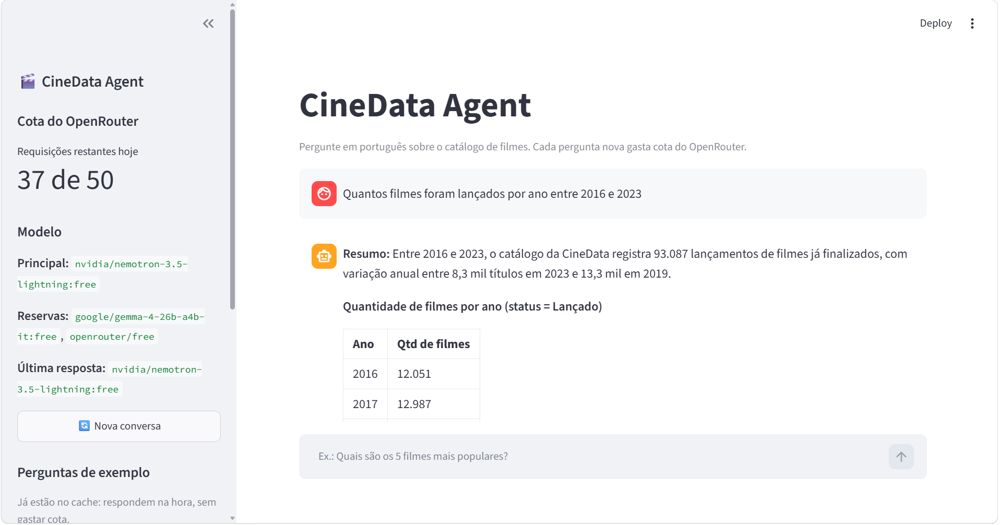
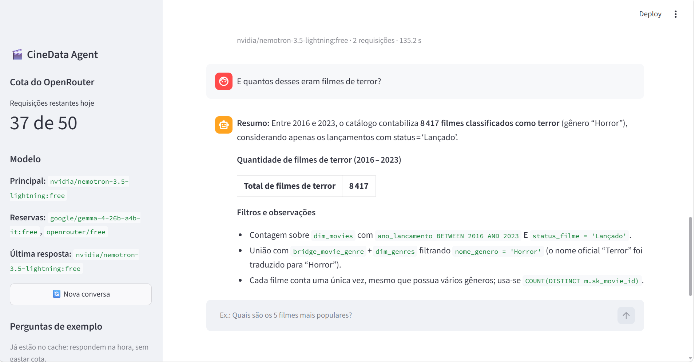
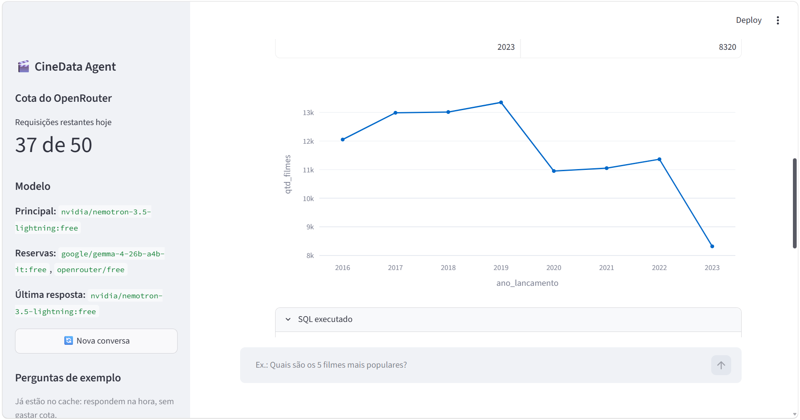
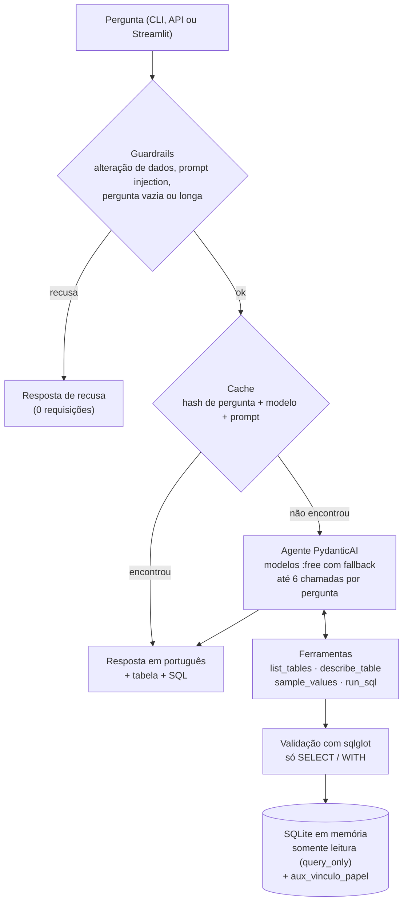

# CineData Agent — Text-to-SQL com GenAI

Agente de IA que responde, em português, perguntas em linguagem natural sobre o catálogo de filmes da **CineData Analytics**. Ele transforma a pergunta em SQL, consulta a camada **Gold** (SQLite) **somente para leitura** e devolve a resposta com a tabela de resultado e o SQL usado. Foi feito com **PydanticAI** e modelos **gratuitos** (`:free`) do OpenRouter, para a Atividade GenAI do Rocket Lab 2026 (Visagio).



---

## Como executar

Pré-requisitos: **Python 3.12+** (exigido pelo `numpy` fixado no `requirements.txt`; testado com o 3.14) e **git**.

### 1. Instalação

**Windows (PowerShell):**

```powershell
git clone https://github.com/AimeGuimaraes/gen_ai-rocketlab.git
cd gen_ai-rocketlab
python -m venv .venv
.venv\Scripts\Activate.ps1
pip install -r requirements.txt
pip install -e .
copy .env.example .env
```

**Linux / Mac:**

```bash
git clone https://github.com/AimeGuimaraes/gen_ai-rocketlab.git
cd gen_ai-rocketlab
python3 -m venv .venv
source .venv/bin/activate
pip install -r requirements.txt
pip install -e .
cp .env.example .env
```

> Se o PowerShell bloquear o `Activate.ps1`, rode antes `Set-ExecutionPolicy -Scope CurrentUser RemoteSigned`.

### 2. Banco e chave

1. Coloque o arquivo **`cinerocket.db`** (baixado pelo link disponibilizado na atividade) na **raiz** do projeto, ao lado deste README.
2. Crie uma chave **gratuita** em [openrouter.ai/keys](https://openrouter.ai/keys). Não precisa de cartão nem de créditos.
3. Abra o `.env` e cole a chave em `LLM_API_KEY=`. As demais variáveis já vêm prontas:

| Variável | Para que serve | Valor padrão |
|---|---|---|
| `LLM_API_KEY` | Sua chave do OpenRouter | (vazio, preencher) |
| `LLM_MODEL` | Modelo principal | `nvidia/nemotron-3.5-lightning:free` |
| `LLM_FALLBACK_MODELS` | Modelos reserva, em ordem | `google/gemma-4-26b-a4b-it:free,openrouter/free` |
| `LLM_BASE_URL` | Endereço do provedor | `https://openrouter.ai/api/v1` |
| `DB_PATH` | Caminho do banco | `cinerocket.db` |
| `DB_TIMEOUT_S` | Tempo máximo de cada consulta, em segundos | `15` |

4. Confira a chave e a cota (**não gasta cota**):

```powershell
python scripts/check_quota.py
```

### 3. Cota do plano gratuito

- O OpenRouter gratuito permite **50 requisições por dia**, e as falhas também contam. A cota zera às **21h (horário de Brasília)**.
- Cada pergunta gasta em média **2,5 requisições**, o que dá cerca de **20 perguntas por dia**.
- Respostas repetidas vêm do cache local (`.cache/`), que não gasta cota. O cache **não vai para o GitHub**, então quem clona o projeto começa com ele vazio.
- Perguntas recusadas pelos guardrails (ex.: "Apague a tabela dim_movies") não chamam o modelo e não gastam cota.

### 4. Três jeitos de usar

**CLI (terminal):**

```powershell
python -m cinedata_agent --help                                      # ajuda (não gasta cota)
python -m cinedata_agent "Quais são os 10 filmes com maior receita em R$?"   # pergunta única
python -m cinedata_agent                                             # modo interativo, com memória; digite "sair" para sair
```

Opções: `-v` mostra os passos do agente e `--no-cache` ignora o cache (sempre gasta cota).

**API (FastAPI):**

```powershell
uvicorn api.main:app --reload
```

Espere aparecer `Application startup complete` (o banco é carregado em memória em cerca de 3 s) e abra **http://127.0.0.1:8000/docs**. Clique no endpoint, em **Try it out** e em **Execute**.

| Endpoint | O que faz | Gasta cota? |
|---|---|---|
| `POST /ask` | Responde uma pergunta | Sim, exceto respostas do cache e recusas |
| `GET /health` | Confere se o banco responde e se a `LLM_API_KEY` está configurada | Não |
| `GET /schema` | Tabelas, colunas e descrições do dicionário de dados | Não |
| `GET /quota` | Cota restante do dia no OpenRouter | Não |

Exemplo de corpo do `POST /ask`:

```json
{"pergunta": "Qual é a quantidade de filmes por gênero?", "session_id": "conversa-1", "usar_cache": true}
```

Códigos de resposta, memória por `session_id`, exemplos com PowerShell e `curl` e outros detalhes: [docs/api.md](docs/api.md).

**Interface (Streamlit):**

```powershell
streamlit run app/streamlit_app.py
```

O navegador abre em **http://localhost:8501**.

- **Chat** com memória: cada resposta mostra o texto, a tabela e o SQL executado. Dá para continuar com "E só os de terror?".
- **Gráfico automático** (sem chamar o modelo) quando o resultado tem de 3 a 30 linhas: barras para texto + número e linha para ano + número.
- **Barra lateral**: cota restante, modelo em uso, botão **Nova conversa** e 5 perguntas de exemplo. Elas respondem na hora quando já estão no cache.
- **Atalho**: `http://localhost:8501/?pergunta=Qual é a quantidade de filmes por gênero?` já abre fazendo a pergunta.





---

## Arquitetura



---

## Decisões técnicas

As regras de negócio completas (lucro, margem, notas, datas, gêneros) estão em [docs/schema_docs.yaml](docs/schema_docs.yaml), seção `regras_de_negocio`.

1. **PydanticAI com modelos `:free` e fallback**: 429 do provedor, 404 e 5xx trocam de modelo; cota esgotada para na hora; `max_retries=0` para nenhuma repetição gastar cota sem aviso.
2. **Duas barreiras de segurança**: o sqlglot só deixa passar `SELECT`/`WITH`, e a conexão é somente leitura (`mode=ro` + `PRAGMA query_only`).
3. **Banco copiado para a memória** com a tabela auxiliar `aux_vinculo_papel` (pessoa × filme com chaves inteiras): a dupla ator-diretor caiu de 104 s para cerca de 1 s; cada consulta tem limite de tempo (`DB_TIMEOUT_S`, padrão 15 s).
4. **Regras de negócio no prompt**: lucro só com receita e orçamento informados; margem agregada (lucro total ÷ receita total) com piso de US$ 100 mil; mínimo de 100 votos nos rankings; valores em R$ pelas colunas `_brl`.
5. **Guardrails antes do modelo e cache com hash do prompt**: recusas não gastam cota, e mudar o prompt invalida as respostas antigas do cache.
6. **Avaliação pelo resultado, não pelo texto do SQL**: o SQL gerado é reexecutado e as linhas são comparadas com o resultado esperado.

---

## Avaliação

Golden set de 20 perguntas ([eval/golden_set.yaml](eval/golden_set.yaml)), cobrindo as perguntas do enunciado, sinônimos, filtros de data, perguntas fora do escopo, pedidos de alteração e prompt injection.

- **Resultado final: 18/19 (94,7%)** (a q17 é ambígua de propósito e fica fora da taxa de acerto), com média de **2,5 requisições por pergunta** (2,8 entre as que chamam o modelo), usando `nvidia/nemotron-3.5-lightning:free`. Conta como acerto trazer as linhas certas (chave) e as métricas certas; colunas só de exibição são opcionais.
- **Histórico:** 16/19 na 1ª rodada → ajustes no critério de comparação e no prompt (mostrar a métrica e a contagem) → 18/19 na rodada final.
- **Erro restante:** na q12 (gênero com maior margem), a 1ª consulta já acerta, mas o modelo continua conferindo até passar do limite de 6 chamadas.
- Detalhes: [eval/report.md](eval/report.md) (relatório da rodada) e [eval/notas.md](eval/notas.md) (rodadas, ajustes e bugs corrigidos).

Para ver o plano de uma rodada sem chamar o modelo: `python eval/run_eval.py --dry-run`. Uma rodada completa gasta cerca de 50 requisições, a cota de um dia inteiro.

---

## Exemplos

Respostas reais da rodada final de avaliação.

**"Quais são os 10 filmes com maior receita em R$?"** (2 requisições)

Lista de Avatar: The Way of Water (2022), com R$ 12,4 bilhões, até Jurassic World: Fallen Kingdom (2018), com R$ 4,9 bilhões. Só entram filmes já lançados com receita informada, e os valores já estão em reais (câmbio histórico do lançamento).

```sql
SELECT m.titulo, m.ano_lancamento, f.receita_brl
FROM dim_movies m
JOIN fact_movies_performance f ON f.sk_movie_id = m.sk_movie_id
WHERE f.receita_brl IS NOT NULL
  AND m.data_lancamento <= date('now')
ORDER BY f.receita_brl DESC
LIMIT 10
```

**"Qual dupla ator-diretor mais trabalhou junta?"** (2 requisições)

Joe Anoa'i e Kevin Dunn, com 37 filmes juntos, seguidos de Colby Lopez e Kevin Dunn (32). Pares em que ator e diretor são a mesma pessoa ficam de fora, e a resposta avisa que há empates.

```sql
SELECT p_actor.nome_pessoa AS ator,
       p_dir.nome_pessoa AS diretor,
       COUNT(DISTINCT a.id_mov) AS qtd_filmes
FROM aux_vinculo_papel a
JOIN aux_vinculo_papel d ON a.id_mov = d.id_mov
JOIN dim_people p_actor ON p_actor.rowid = a.id_pes
JOIN dim_people p_dir ON p_dir.rowid = d.id_pes
WHERE a.tipo_pessoa = 'Ator'
  AND d.tipo_pessoa = 'Diretor'
  AND p_actor.nome_pessoa != p_dir.nome_pessoa
GROUP BY p_actor.nome_pessoa, p_dir.nome_pessoa
ORDER BY qtd_filmes DESC
LIMIT 10
```

**Memória de conversa:** três perguntas encadeadas pela API ("E qual deles teve o maior orçamento?", "Mostre esses mesmos valores em reais") em [docs/exemplo_memoria.md](docs/exemplo_memoria.md).

---

## Testes

```powershell
pytest       # 279 testes, cerca de 20 s
ruff check .
```

Os testes **nunca chamam o modelo de verdade**: usam o `TestModel`/`FunctionModel` do PydanticAI e mocks, então não gastam cota. Eles cobrem a validação de SQL, os guardrails, o cache, o fallback de modelos, as ferramentas, a API, a interface e o comparador da avaliação.

---

## Estrutura do projeto

```text
gen_ai-rocketlab/
├── src/cinedata_agent/     # pacote do agente
│   ├── agent.py            #   agente PydanticAI, fallback de modelos e limite de chamadas
│   ├── tools.py            #   ferramentas do agente (tabelas, colunas, amostras, SQL)
│   ├── db.py               #   banco em memória, validação de SQL e execução com limite de tempo
│   ├── prompts.py          #   prompt de sistema com regras de negócio e exemplos
│   ├── guardrails.py       #   recusas antes de chamar o modelo
│   ├── cache.py            #   cache das respostas (.cache/)
│   ├── schema.py           #   leitura do dicionário de dados
│   ├── config.py, quota.py #   configuração (.env) e consulta da cota
│   ├── graficos.py         #   escolha do gráfico automático
│   └── __main__.py         #   CLI
├── api/main.py             # API FastAPI
├── app/streamlit_app.py    # interface Streamlit
├── eval/                   # golden set, resultados esperados, script e relatórios da avaliação
├── docs/                   # dicionário de dados, perguntas do enunciado, API, prints
├── scripts/                # check_quota.py (cota) e test_llm.py (teste do modelo, gasta cota)
├── notebooks/              # exploração inicial dos dados
├── tests/                  # testes pytest
├── .env.example            # modelo do .env
└── requirements.txt        # versões testadas das dependências
```

---

## Limitações e próximos passos

Principais limitações (lista completa em [docs/schema_docs.yaml](docs/schema_docs.yaml), seção `limitacoes_conhecidas`):

1. **Modelos gratuitos**: podem sair do ar, ficar lentos ou deixar de ser gratuitos (o `z-ai/glm-5.2:free` do guia deixou de ser gratuito em 04/10/2026). O fallback ajuda, mas não resolve tudo.
2. **Consultas extras**: em algumas perguntas (como a q12) o modelo continua conferindo depois de já ter a resposta e pode passar do limite de 6 chamadas.
3. **Títulos repetidos**: em perguntas de acompanhamento o agente às vezes filtra só pelo título, o que pode misturar filmes homônimos (4.558 títulos se repetem na base).
4. **Avaliações de usuários** parecem dados de exemplo (todas criadas no mesmo instante, concentradas em poucos filmes), e as notas IMDb parecem ligadas pelo título.
5. **Dados incompletos**: `idioma_original` está 100% vazio, só 1.630 filmes têm receita e orçamento, e os votos TMDB vão só até cerca de 2023.
6. **Textos em inglês**: sinopses e nomes de gêneros estão em inglês; o agente traduz os gêneros, mas não as sinopses.

Próximos passos: busca semântica nas sinopses e conexão direta com o Databricks.
